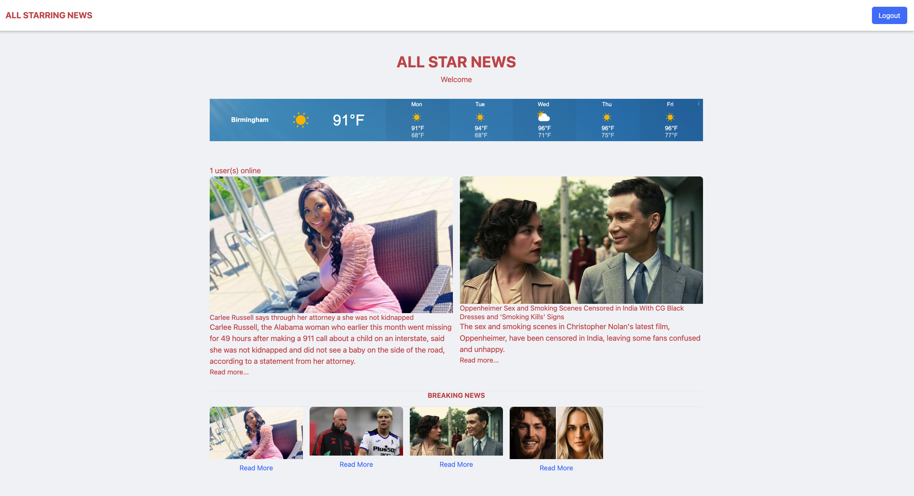

# Project2# All Star News Broadcasting Site

Our news team of 5 set out to create the best unbiased center for news consumption.
We worked together to create a news website where people could view live updating news sources and weather based on your desired location.
Each article has a hyperlink below the description to take you straight to each articles direct source.

## How to Use

To use our website, simply open the link to the deployed site to bring you to the login page. There, you will see the option to sign up to create an account or login into your created account. Once logged in, you will see the home page with main headlines at the front main part of the page. The second important part of the page is in the top left where you will find a search bar and right above that will be the temperature, location, and conditions. The search bar will allow for changing the desired location of the weather search which by default is set to New York. Now back to those articles towards the bottom of the page. Under each article description you will find a blue hyperlink which when clicked will send the user straight to the article source.

## Screenshot of deployed site

 

## link to deployed site

https://floating-garden-70719-44bdf24b09b1.herokuapp.com/

## Resource links

https://gnews.io

https://www.weatherapi.com

https://tailwindcss.com/

## Google slide link 

https://docs.google.com/presentation/d/119KSxM3xpsLlDsGZM22FclG1Fq0PUxeGFlqRWiJRibI/edit?usp=sharing

